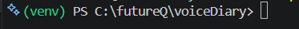

## Hui 的筆記

####　6/11 日誌

- 建立專案
主要是基本的架構要一致，先前建立的REST API + Flutter版本對於現在來說有一定的學習成本，改成簡單的html + Django
- 建立資料庫 `User`, `DiaryEntry`, `CognitiveAnalysis`, `AiConversation`


> ##### venv 啟動

1. 建立虛擬環境
跟目錄上應該會有一個資料夾叫  `venv` 如果沒有的話才輸入以下指令

```
<!-- powershell 中創建虛擬環境 -->
python -m venv venv
```
2. 一般狀況(若為第二次進入虛擬環境直接做這一步即可)

在專案資料夾的層級下在powershell輸入

```
.\venv\Scripts\Activate.ps1
```
就應該會有以下的畫面終端機旁邊會出現`(venv)`
(futureQ是我自己的分類資料夾，每個人目錄的不一定一樣)


3. 套件安裝
  
虛擬環境用好後要把套件裝一下，系統就會自己跑這個專案要的套件

```
pip install -r requirements.txt
```

⚠️環境是完全沒有venv才要做這些步驟，如果發現是少裝套件的話執行 `2` 跟 `3` ，平時都是`2`就可以了

---