## 教學文件

> 目錄
- [venv](#venv-啟動)
- [ whisper 安裝(請確認已經進入虛擬環境)](#whisper安裝請確認已經進入虛擬環境)

#### **注意! Whisper模型是裝在虛擬環境，非全域(如果想裝在自己電腦上玩，跳過venv啟動步驟)** 
  

> ##### venv 啟動

1. 建立虛擬環境
根目錄上應該會有一個資料夾叫  `venv` 如果沒有的話才輸入以下指令

```
<!-- powershell 中創建虛擬環境 -->
python -m venv venv
```
2. 一般狀況(若為第二次進入虛擬環境直接做這一步即可)

在專案資料夾的層級下在powershell輸入

```
.\venv\Scripts\Activate.ps1
```
就應該會有以下的畫面終端機旁邊會出現`(venv)`
(futureQ是我自己的分類資料夾，每個人目錄的不一定一樣)


3. 套件安裝
  
虛擬環境用好後要把套件裝一下，系統就會自己跑這個專案要的套件

```
pip install -r requirements.txt
```

⚠️環境是完全沒有venv才要做這些步驟，如果發現是少裝套件的話執行 `2` 跟 `3` ，平時都是`2`就可以了

---

> ##### whisper安裝(請確認已經進入虛擬環境)
1. 下載模型
第一次下載會有部分的快取檔案在本機

```
pip install openai-whisper
```

跑到看到:
```
[notice] A new release of pip is available: 24.2 -> 26.1.2
[notice] To update, run: python.exe -m pip install --upgrade pip
```

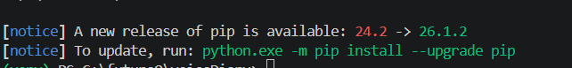

2. ffmpeg 音訊解碼exe 環境變數

- 在這個網頁上最新的file中找到`ffmpeg-master-latest-win64-gpl-shared`後下載這個資料夾
https://github.com/BtbN/FFmpeg-Builds/releases

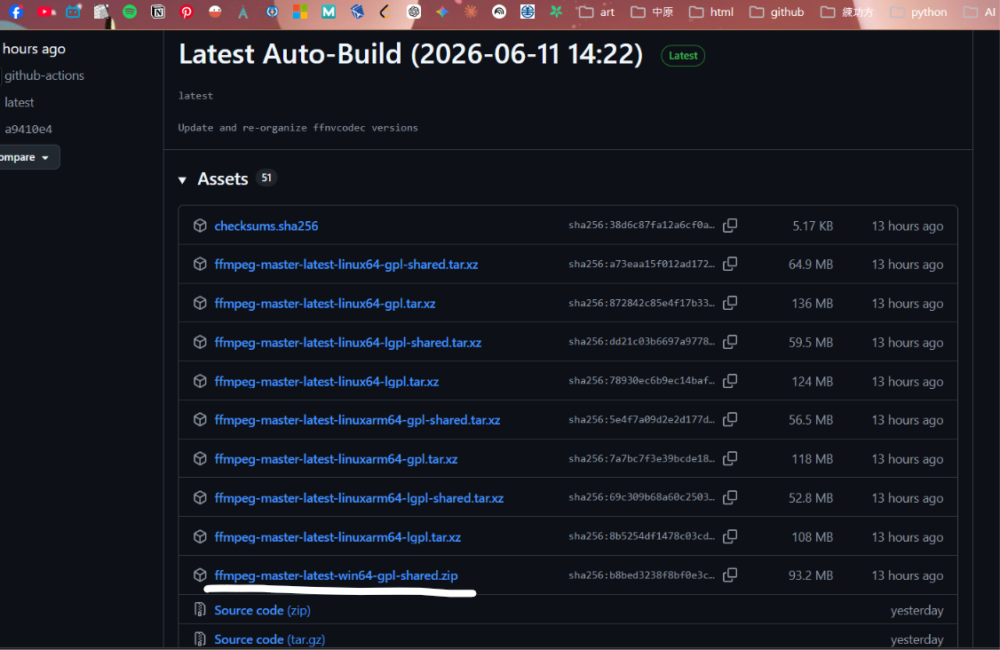

- 解壓縮後進入到檔案總管`bin`資料夾所在的目錄
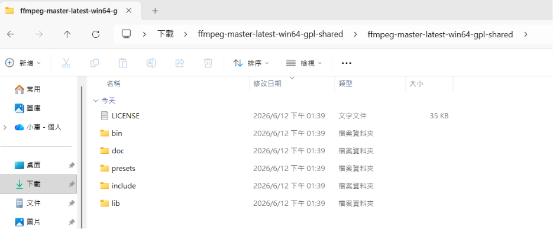

- 將這些資料複製後在`C:\Program Files`新建資料夾`ffmpeg`
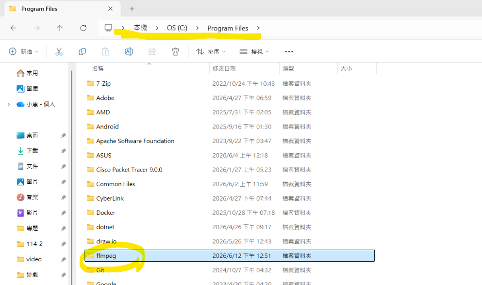

- 接著把剛剛的資料全部paste到這個資料夾裡面
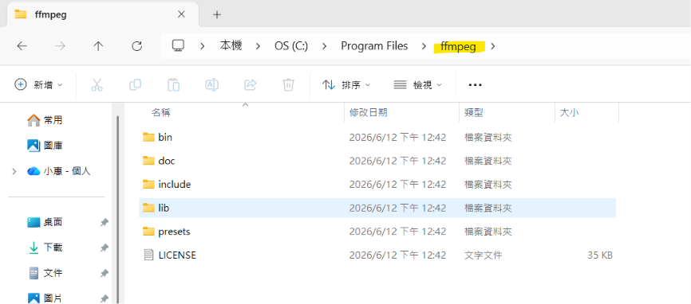

- 點擊 資料夾`bin`後複製他的路徑
 

- 進入環境變數更改，打開終端機輸入：
```
sysdm.cpl
```
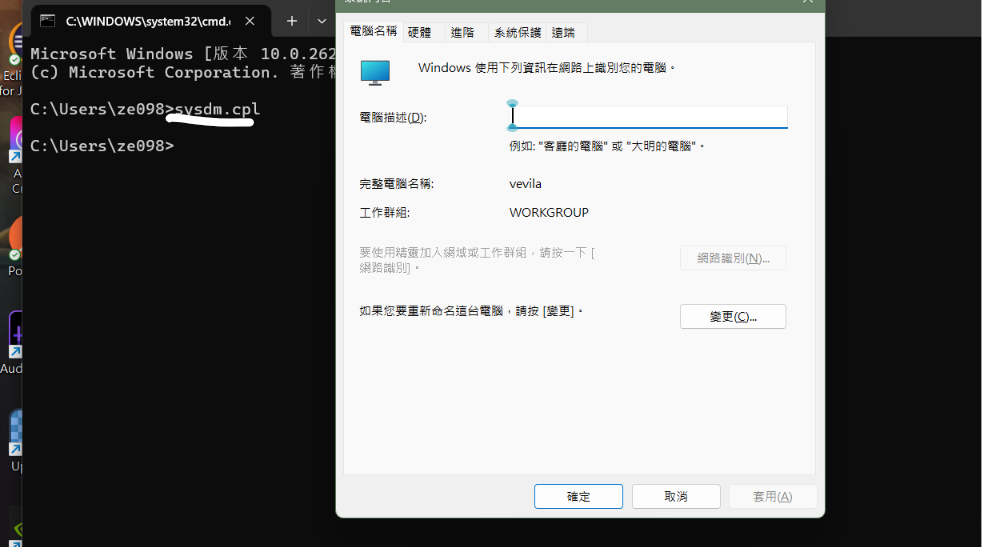

- 點擊`進階`選擇`環境變數`
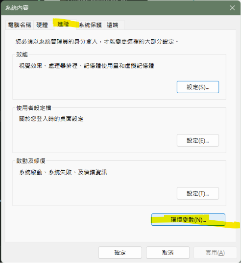

- 雙擊`PATH`進入編輯，把剛剛的路徑新增上去
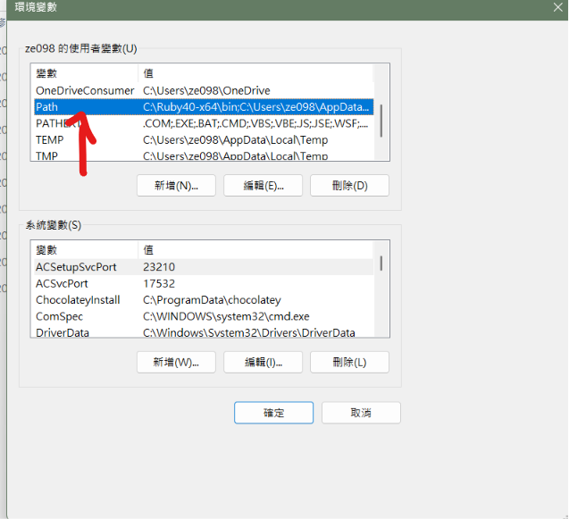
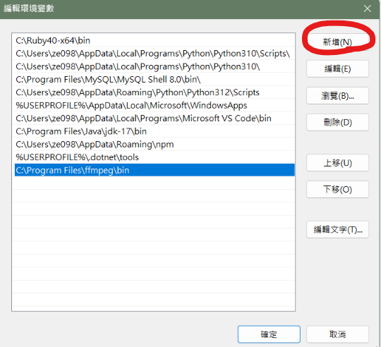

**注意!! 一定要先把所有的終端機關掉，環境變數這邊要把所有確認點擊**

- 完成後打開powershell 輸入：

```
ffmpeg -version
```
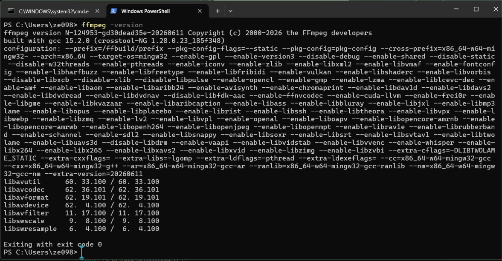

- 測試方式是可以先將已經錄好的音檔上傳到電腦，打開終端到該檔案的位置

```
<!-- 直接在聲影日記裡的專案做測試 -->

錄音內容:測試 測試 whisper 測試

(venv) PS C:\你的音檔路徑> whisper 你的音檔名稱.mp3(m4a...) --model base  
```

- 會產生5個files 在同層音檔資料夾
結果：
```
(venv) PS C:\futureQ\voiceDiary\media\audio> whisper Vtest.m4a --model base
C:\futureQ\voiceDiary\venv\Lib\site-packages\whisper\transcribe.py:132: UserWarning: FP16 is not supported on CPU; using FP32 instead
  warnings.warn("FP16 is not supported on CPU; using FP32 instead")
Detecting language using up to the first 30 seconds. Use `--language` to specify the language
Detected language: Chinese
[00:00.000 --> 00:03.400] 測試測試Visper測試
```
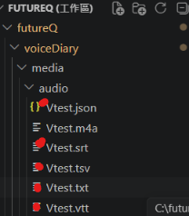
(我是在咖啡廳錄音，環境也有音樂，他辨識很膩害捏)


> **跑出來的話，恭喜你成功將Whisper安裝到系統啦**
---

